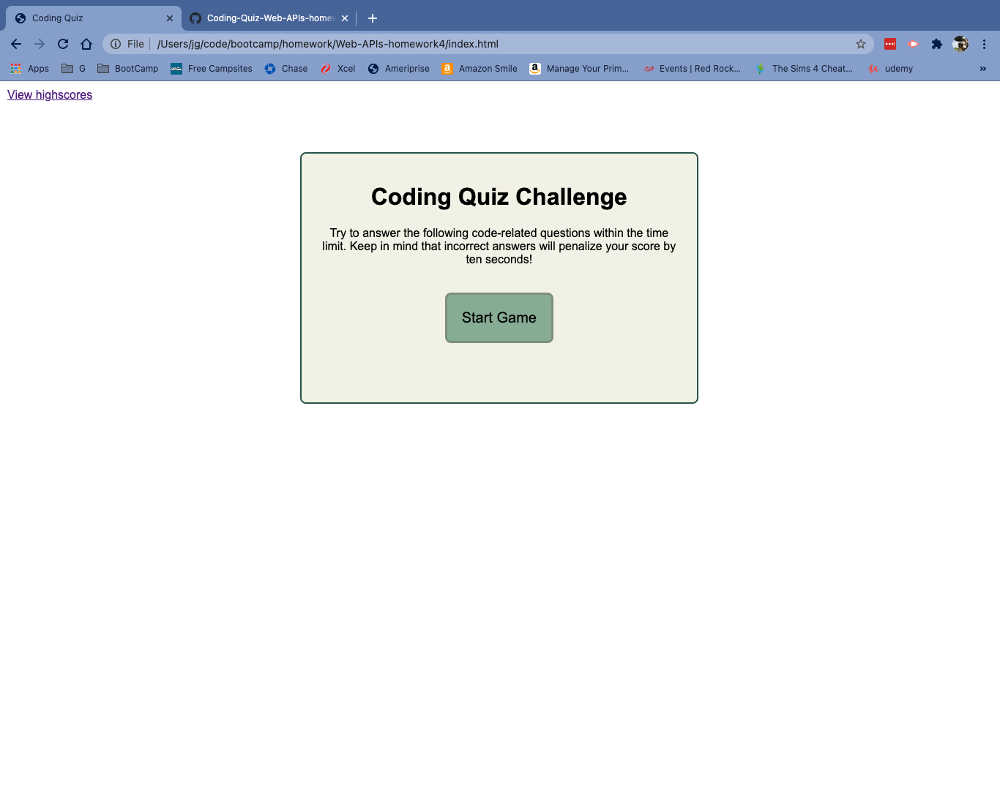
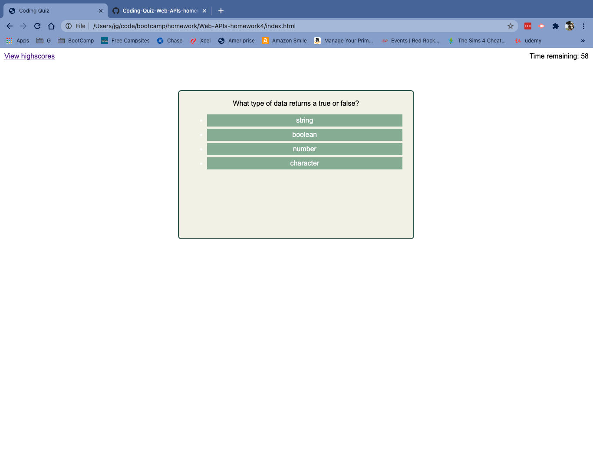
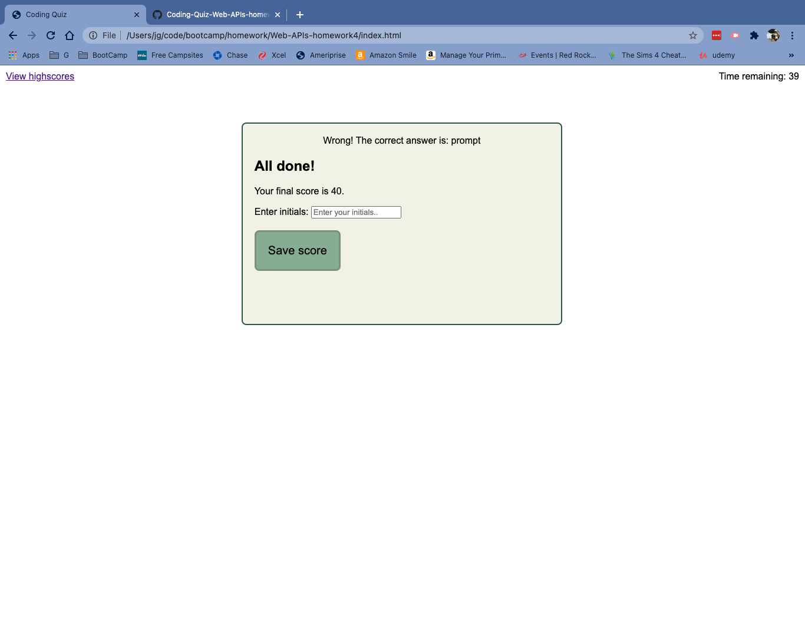
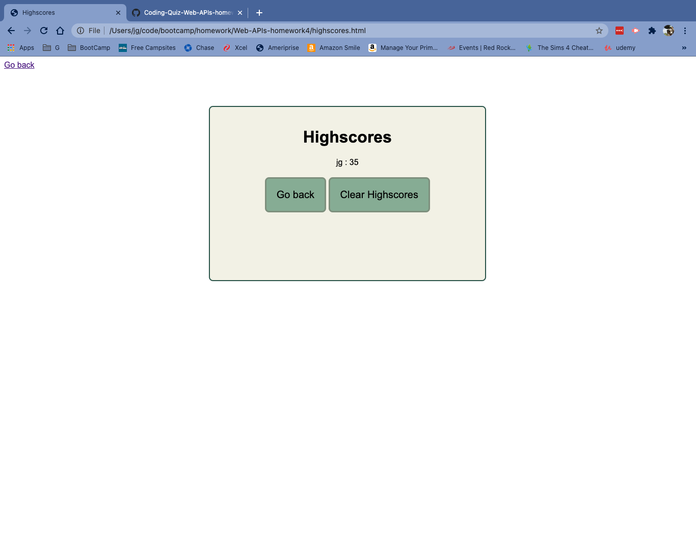

# Web APIs: Code Quiz

### Table of Contents:
* [User Story](#user-story)
* [Description](#description)
* [Usage](#Usage)
* [Mock-Up](#Mock-Up)

[Code Quiz](https://jenngreiner.github.io/Coding-Quiz-Web-APIs-homework4/)

## User Story
As a full-stach we developer, I want to be able to creat a quiz using multiple choice questions and a timer. I also want to be able to store the highscores from the quiz in a single list that player can refer to while playing the game. 

## Description 
This project allows users to take a timed 5 question quiz on coding basics. At the end of the quiz, the user's score is equal to the time remaining. If th euser selects a wrong answer, their time is deducted 10 seconds. Once all of the questions are answered, ot the time remaining is 0 seconds, the user is given their score and prompted to save it to the highscores list. If the user's score is less than a preivous score with the same initials, only the highest scores is retained. 

## Usage
Open the [Code Quiz](https://jenngreiner.github.io/Coding-Quiz-Web-APIs-homework4/) in your browser. Click start to begin the quiz. Click on an option for each question, text will appear at the bottom telling you if your answer was right, or if not, what the correct answer is. Each wrong answer deducts 5 second off of the time remaining. Once all of the questions are answered, or the timer runs out, the game ends. The user can enter their initials and save their higscore. Onve the user clicks "Save score", they are taken to the current highscore list. The user can click "Go back" to retake the quiz, or "Clear highscores" to reset the highscores list. 

## Mock-Up

The following image shows the code quiz's appearance and functionality:

### The user can click Start game to begin the quiz 

### The user selects an answer for each question

### The user can save their initials and score to the highscores list

### The user can view all previous highscores

## Credits
* https://www.w3schools.com/
* https://www.color-hex.com/
* https://developer.mozilla.org/
- - -

